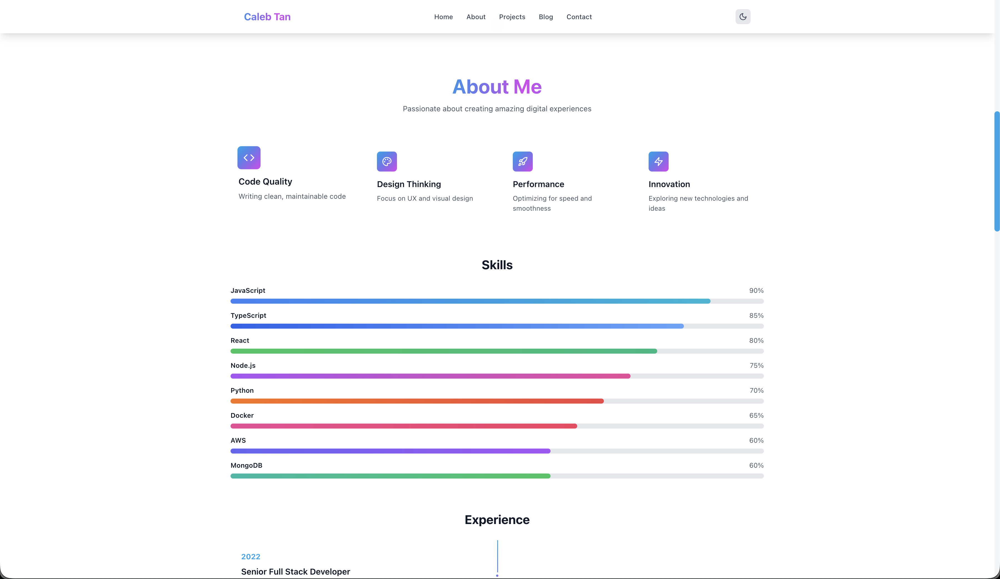
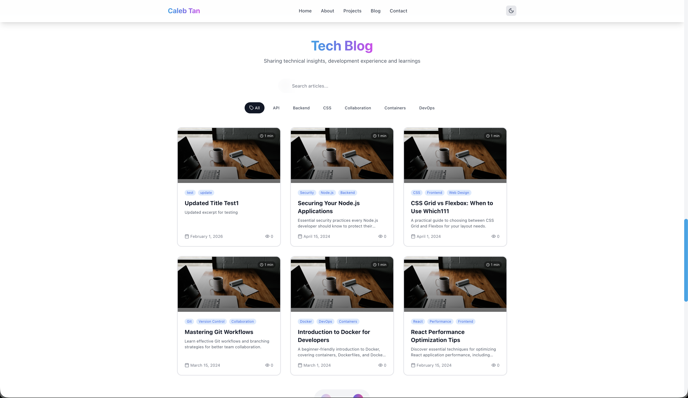
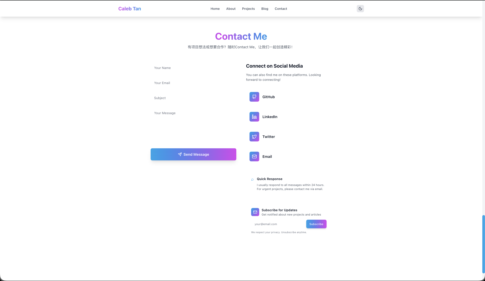

# 🚀 Personal Portfolio Website

<div align="center">

A modern, full-stack personal portfolio website built with React + TypeScript + Framer Motion, featuring a hybrid database architecture (MySQL + MongoDB) for optimal performance.

[](https://github.com/Besta0/blogkk)
[](https://hub.docker.com/r/caleb333/blogkk)

[Live Demo](#) • [Documentation](#-documentation) • [Report Bug](https://github.com/Besta0/blogkk/issues) • [Request Feature](https://github.com/Besta0/blogkk/issues)

**🌐 Language:** [English](README.md) | [中文](README-zh.md)

</div>

---

## 📸 Screenshots

<div align="center">

### 🏠 Home Page

*Modern hero section with animated gradients and interactive elements*

### 👤 About Section

*Skills showcase with progress bars and experience timeline*

### 💼 Projects

*Featured projects with filtering and detailed views*

### 📝 Blog

*Tech blog with Markdown support and tag filtering*

### 📧 Contact

*Contact form with social media integration*

</div>

---

## 📚 Documentation

| Document | Description |
|----------|-------------|
| [Deployment Guide](DEPLOYMENT.md) | Complete deployment instructions |
| [API Documentation](API_DOCUMENTATION.md) | Full API reference |
| [Admin Manual](ADMIN_MANUAL.md) | Admin dashboard user guide |
| [Environment Configuration](ENV_CONFIGURATION.md) | Environment variables guide |
| [Backend README](backend/README.md) | Backend-specific documentation |

---

## ✨ Features

- 🎨 **Stunning Visual Effects** - Gradients, glassmorphism, 3D animations
- 🖱️ **Rich Interactions** - Magnetic buttons, scroll animations
- 🌓 **Dark/Light Theme** - Theme switching support
- 📱 **Responsive Design** - Perfect adaptation to all devices
- ⚡ **Performance Optimized** - Built with Vite for fast loading
- 🐳 **Docker Support** - One-click deployment
- 🔐 **Admin Dashboard** - Full content management system
- 📝 **Blog System** - Markdown-based blog with tags
- 📊 **Analytics** - Built-in visitor statistics with real-time tracking
- 🔒 **JWT Authentication** - Secure admin access with refresh tokens
- 🗄️ **Hybrid Database** - MySQL for structured data, MongoDB for analytics

## 🛠️ Tech Stack

### Frontend
- **React 18** - UI Framework
- **TypeScript** - Type Safety
- **Vite** - Build Tool
- **Tailwind CSS** - Styling Framework
- **Framer Motion** - Animation Library
- **TanStack Query** - Data Fetching
- **Lucide React** - Icon Library

### Backend
- **Node.js** - Runtime
- **Express** - Web Framework
- **TypeScript** - Type Safety
- **TypeORM** - MySQL ORM with full type support
- **Mongoose** - MongoDB ODM for analytics
- **JWT** - Authentication with refresh tokens
- **Cloudinary** - Image Storage

### Database Architecture
- **MySQL** - Structured data (Users, Projects, Blog Posts, Profiles)
- **MongoDB** - Analytics data (Page Views, Interactions, Logs)

### DevOps
- **Docker** - Containerization
- **Docker Compose** - Orchestration
- **Nginx** - Web Server

## 📦 Installation & Running

### Prerequisites

- Node.js >= 18.0.0
- npm >= 9.0.0
- Docker & Docker Compose (recommended)
- MySQL 8.0+ (or SQLite for development)
- MongoDB 6.0+ (or mongodb-memory-server for testing)
- Cloudinary account (for image uploads)

---

## 🔧 Development Environment

### Quick Start with Docker (Recommended)

The development environment includes hot reload for both frontend and backend:

```bash
# Clone the repository
git clone https://github.com/Besta0/blogkk.git
cd blogkk

# Start development environment with hot reload
./dev.sh

# Or manually
docker-compose -f docker-compose.dev.yml up --build
```

**Access Points:**
- Frontend: http://localhost:5050
- Backend API: http://localhost:3010
- Admin Dashboard: http://localhost:5050/admin
- MySQL: localhost:3308
- MongoDB: localhost:27019

### Initialize Development Data

```bash
# Create admin account (required)
docker-compose -f docker-compose.dev.yml exec backend npm run init:admin

# Or with custom credentials
docker-compose -f docker-compose.dev.yml exec backend npm run init:admin your-email@example.com your-password

# Seed test data (optional - for development only)
docker-compose -f docker-compose.dev.yml exec backend npm run seed
```

**Default Admin Credentials:**
- Email: admin@example.com
- Password: admin123

### Local Development (Without Docker)

```bash
# Install dependencies
npm install
cd backend && npm install && cd ..

# Configure environment variables
cp .env.example .env
cp backend/.env.example backend/.env

# Edit .env files with your configuration
# Frontend .env: VITE_API_BASE_URL=http://localhost:3010
# Backend .env: PORT=3000, DB settings, etc.

# Terminal 1 - Start backend
cd backend
npm run dev

# Terminal 2 - Start frontend
npm run dev

# Terminal 3 - Initialize admin
cd backend
npm run init:admin
```

### Development Environment Features

✅ **Hot Reload** - Changes reflect immediately without restart  
✅ **Separate Ports** - No conflict with production environment  
✅ **Test Data** - Use `seed` script to populate sample data  
✅ **Debug Mode** - Detailed logging and error messages  
✅ **Isolated Database** - Uses `portfolio_dev` database

### ⚠️ Development Environment Notes

1. **Test Data**: The `seed` script is safe to use in development
2. **Port Configuration**: Development uses ports 5050/3010, production uses 5060/3020
3. **Database**: Uses separate `portfolio_dev` database
4. **Hot Reload**: File changes trigger automatic reload
5. **Debugging**: Check logs with `docker-compose -f docker-compose.dev.yml logs -f`

---

## 🚀 Production Environment

### Docker Deployment (Recommended)

#### Step 1: Configure Environment Variables

```bash
# Copy production environment templates
cp .env.production.example .env.production
cp backend/.env.production.example backend/.env.production

# Edit production configuration
nano .env.production
nano backend/.env.production
```

**Critical Production Settings:**
- Set strong `JWT_SECRET` and `JWT_REFRESH_SECRET` (64+ characters)
- Configure production database URLs
- Set up Cloudinary credentials
- Configure SMTP for email functionality
- Set secure admin credentials

#### Step 2: Deploy with Docker Compose

```bash
# Build and start all services (includes MySQL & MongoDB)
docker-compose up -d --build

# View logs
docker-compose logs -f

# Check service status
docker-compose ps
```

#### Step 3: Initialize Production Database

```bash
# Create admin account (REQUIRED)
docker-compose exec backend npm run init:admin admin@yourdomain.com SecurePassword123!

# Set up database indexes (REQUIRED)
docker-compose exec backend npm run setup-indexes

# Check data consistency (OPTIONAL)
docker-compose exec backend npm run check-consistency
```

**Access Points:**
- Frontend: http://localhost:5060
- Backend API: http://localhost:3020
- Admin Dashboard: http://localhost:5060/admin
- MySQL: localhost:3307
- MongoDB: localhost:27018

#### Alternative: Quick Start with Docker Hub

```bash
# Pull and run from Docker Hub
docker run -d -p 5060:80 --name blogkk caleb333/blogkk:latest

# View logs
docker logs -f blogkk
```

Visit http://localhost:5060

### 🔒 Production Environment Security

**Important Security Practices:**

1. **Strong Credentials**
   ```bash
   # Generate secure JWT secrets
   openssl rand -base64 64
   ```

2. **Environment Variables**
   - Never commit `.env` files to version control
   - Use strong, unique passwords for all services
   - Rotate secrets regularly (every 90 days)

3. **Database Security**
   - Use strong database passwords
   - Enable database authentication
   - Configure IP whitelisting (for cloud databases)
   - Regular backups (daily recommended)

4. **SSL/HTTPS**
   - Always use HTTPS in production
   - Configure SSL certificates (Let's Encrypt recommended)
   - Set up proper CORS policies

5. **Admin Access**
   - Use strong admin passwords (12+ characters)
   - Enable 2FA if available
   - Limit admin access to trusted IPs
   - Monitor admin activity logs

### ⚠️ Production Environment Warnings

❌ **DO NOT** run `npm run seed` in production - it adds test data!  
❌ **DO NOT** use default credentials (admin@example.com / admin123)  
❌ **DO NOT** expose database ports publicly  
❌ **DO NOT** use development environment variables  
✅ **DO** backup your database regularly  
✅ **DO** monitor application logs  
✅ **DO** use strong, unique passwords  
✅ **DO** enable HTTPS/SSL  

### Production Maintenance

```bash
# View logs
docker-compose logs -f backend
docker-compose logs -f frontend

# Restart services
docker-compose restart

# Update application
git pull origin main
docker-compose up -d --build

# Backup database
docker-compose exec mysql mysqldump -u root -p portfolio > backup.sql
docker-compose exec mongodb mongodump --out=/backup

# Stop services
docker-compose down

# Stop and remove all data (DANGEROUS!)
docker-compose down -v
```

## 🎯 Project Structure

```
.
├── src/                     # Frontend source code
│   ├── admin/               # Admin dashboard
│   │   ├── components/      # Admin components
│   │   ├── context/         # Auth context
│   │   └── pages/           # Admin pages
│   ├── api/                 # API client and hooks
│   │   └── hooks/           # React Query hooks
│   ├── components/          # React Components
│   ├── hooks/               # Custom hooks
│   ├── providers/           # Context providers
│   └── App.tsx              # Main app component
├── backend/                 # Backend source code
│   └── src/
│       ├── config/          # Database & app configuration
│       │   └── database.ts  # MySQL & MongoDB connections
│       ├── controllers/     # Route controllers
│       ├── middleware/      # Express middleware
│       ├── models/          # TypeORM entities & Mongoose schemas
│       │   ├── user.model.ts        # User entity (MySQL)
│       │   ├── project.model.ts     # Project entity (MySQL)
│       │   ├── blogPost.model.ts    # Blog entity (MySQL)
│       │   ├── profile.model.ts     # Profile entity (MySQL)
│       │   └── analytics.model.ts   # Analytics schemas (MongoDB)
│       ├── routes/          # API routes
│       ├── services/        # Business logic
│       ├── scripts/         # CLI scripts
│       │   ├── init-admin.ts        # Initialize admin user
│       │   ├── seed-data.ts         # Seed test data
│       │   └── migrate-to-mysql.ts  # Data migration tool
│       └── utils/           # Utilities
├── docker-compose.yml       # Production Docker config
├── docker-compose.dev.yml   # Development Docker config
└── package.json             # Project config
```

## 🗄️ Database Schema

### MySQL (Structured Data)
- **Users** - Admin accounts with JWT authentication
- **RefreshTokens** - Token management for secure sessions
- **Profiles** - Personal information and skills
- **Projects** - Portfolio projects with images
- **BlogPosts** - Blog articles with markdown support
- **ContactMessages** - Contact form submissions
- **Newsletters** - Email subscriptions

### MongoDB (Analytics Data)
- **PageViews** - Visitor tracking with session support
- **ProjectInteractions** - Project views, likes, shares
- **FileMetadata** - Uploaded file information
- **SystemLogs** - Application logs with TTL auto-cleanup

## 🔧 Customization

### Update Personal Information

**Option 1: Using Admin Dashboard (Recommended)**

1. Access the admin dashboard at `/admin`
2. Login with your admin credentials
3. Navigate to "Profile" to edit personal information
4. Navigate to "Projects" to manage your portfolio
5. Navigate to "Blog" to write articles

**Option 2: Direct File Editing (Static Content)**

Edit the following files to update static content:

- `src/components/HeroSection.tsx` - Main title and subtitle
- `src/components/AboutSection.tsx` - Skills and timeline
- `src/components/ProjectsSection.tsx` - Project list
- `src/components/ContactSection.tsx` - Contact info and social links

### Modify Theme Colors

Edit color configuration in `tailwind.config.js`:

```js
colors: {
  primary: { ... },  // Primary color
  accent: { ... },   // Accent color
}
```

## 🧪 Testing

```bash
# Run backend tests
cd backend
npm test

# Run tests with coverage
npm run test:coverage

# Run specific test file
npm test -- auth.service.test.ts
```

The project uses:
- **Jest** - Test framework
- **fast-check** - Property-based testing
- **SQLite** - In-memory database for tests
- **mongodb-memory-server** - In-memory MongoDB for tests

---

## 📋 Environment Comparison

| Feature | Development | Production |
|---------|-------------|------------|
| **Frontend Port** | 5050 | 5060 |
| **Backend Port** | 3010 | 3020 |
| **MySQL Port** | 3308 | 3307 |
| **MongoDB Port** | 27019 | 27018 |
| **Database Name** | portfolio_dev | portfolio |
| **Hot Reload** | ✅ Enabled | ❌ Disabled |
| **Debug Logging** | ✅ Verbose | ⚠️ Minimal |
| **Seed Script** | ✅ Allowed | 🚫 Blocked |
| **JWT Expiry** | 1 hour | 15 minutes |
| **HTTPS** | ❌ Optional | ✅ Required |
| **Minification** | ❌ No | ✅ Yes |

---

## 🔧 Management Scripts

The backend includes several management scripts for database operations:

```bash
# Initialize admin account
npm run init:admin [email] [password]

# Seed test data (development only)
npm run seed

# Force seed in production (NOT RECOMMENDED)
npm run seed:prod

# Set up database indexes
npm run setup-indexes

# Check data consistency
npm run check-consistency

# Migrate data from MongoDB to MySQL
npm run migrate
```

For detailed script documentation, see [backend/SCRIPTS.md](backend/SCRIPTS.md)

## 📝 Production Deployment

For detailed deployment instructions, see [DEPLOYMENT.md](DEPLOYMENT.md).

### Quick Start

```bash
# 1. Clone repository
git clone https://github.com/Besta0/blogkk.git
cd blogkk

# 2. Configure environment variables
cp .env.production.example .env.production
cp backend/.env.production.example backend/.env.production

# 3. Deploy with Docker Compose
docker-compose up -d --build

# 4. Initialize admin account
docker-compose exec backend npm run init-admin
```

### Cloud Platforms

| Platform | Frontend | Backend | Database |
|----------|----------|---------|----------|
| Vercel | ✅ | ❌ | ❌ |
| Railway | ✅ | ✅ | ✅ MySQL & MongoDB |
| AWS | ✅ | ✅ | ✅ RDS & DocumentDB |
| DigitalOcean | ✅ | ✅ | ✅ Managed DB |

## 🤝 Contributing

Contributions are welcome! Please feel free to submit a Pull Request.

1. Fork the project
2. Create your feature branch (`git checkout -b feature/AmazingFeature`)
3. Commit your changes (`git commit -m 'Add some AmazingFeature'`)
4. Push to the branch (`git push origin feature/AmazingFeature`)
5. Open a Pull Request

## 📄 License

This project is licensed under the MIT License - see the [LICENSE](LICENSE) file for details.

## 🙏 Acknowledgments

- [Framer Motion](https://www.framer.com/motion/) - Powerful animation library
- [Tailwind CSS](https://tailwindcss.com/) - Utility-first CSS framework
- [TypeORM](https://typeorm.io/) - TypeScript ORM for MySQL
- [Mongoose](https://mongoosejs.com/) - MongoDB ODM

<div align="center">

⭐ If this project helped you, please give it a star!

Made with ❤️ by [Caleb Tan](https://github.com/Besta0)

</div>
